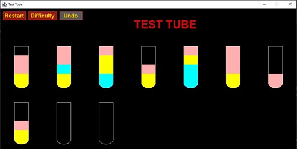
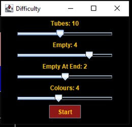
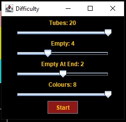
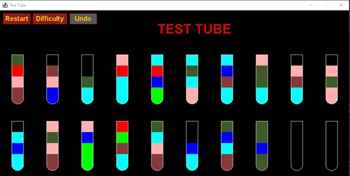
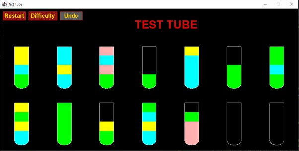
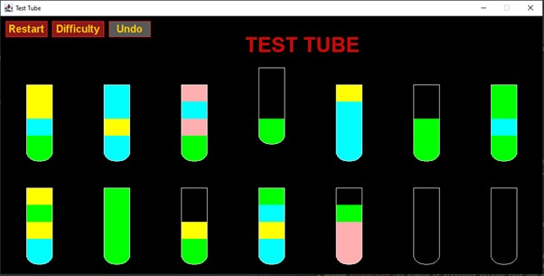
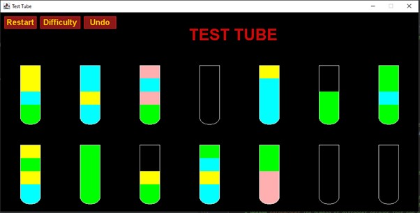
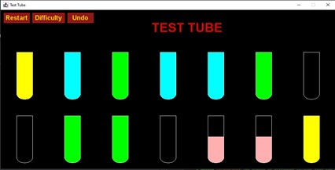
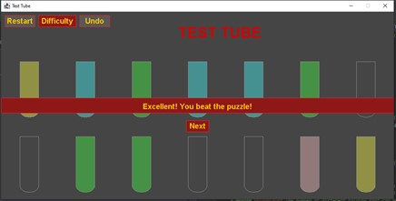
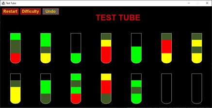

# 1.1 Test Tube (Water Puzzle Game Clone) Overview

**Overview written by Peter Mitchell.**

## Contents

```
1.1 Test Tube (Water Puzzle Game Clone) Overview
1.2 Introduction
1.3 The Rules of Test Tube
1.4 High Level Discussion About Implementation
1.5 How the Core Game Works
1.6 Features You Could Add
```
# 1.2 Introduction

This readme will explain the fundamentals of how the Test Tube game works. You can view a PDF version in the folder.

- ([Youtube Demo](https://youtu.be/vdU5us7QbQY))

# 1.3 The Rules of Test Tube

The game is based on the rule set in the game “Water Sort Puzzle – Color Sorting Game” found on
Google Play at:

https://play.google.com/store/apps/details?id=com.gma.water.sort.puzzle&hl=en_AU&gl=US

The rules can be summarised as follow:

- The player is presented with some number of test tubes that each have four segments. Each
    segment can hold a single colour or can be empty.
- The puzzle starts with colours shuffled such that there are 0 or more empty test tubes at the
    end, and possibly for when the solution in complete additional test tubes empty. Each colour
    has segments shown that are in multiples of four randomly spread across the test tubes.
- The player can select test tubes that are not empty and pour them into another test tube that
    either has the same colour on the top or are empty. The colours transferred to the new test
    tube take as many of the matching colour at the top of the one being poured to fill as much
    space as possible in the one being poured into.
- The game ends when the player successfully makes all the test tubes contain four of the same
    colours, with any remaining empty.
- The player can undo their moves with an undo button, reset the entire puzzle with the reset
    button, or change the difficulty settings with a difficulty button.


# 1.4 High Level Discussion About Implementation

The game begins by defaulting to something similar to what is seen below. You can see it has defaulted
to 10 test tubes, with 2 empty test tubes at the end, and an additional 2 that will be empty when
everything has moved around. The puzzle used up to four colours, but in this case only 3 were
randomly selected.



If the player wished to change the difficulty, they could press the Difficulty button located at the top
left. This would display a dialog as shown below in the two images. The default settings are shown on
the left. Moving the Tubes slider will modify the maximums for both the Empty and Empty at End.
Empty can only have a max of half the Tubes value, and Empty at End only has a maximum of whatever
Empty is set to. Colours is based on the total set of colours available. In this case there are 8 defined
colours.

 

In this case the settings it has been changed to on the right would create a game with 20 test tubes
where at the end solution 4 would be empty, and 2 test tubes start empty at the end, with maximum
variety of 8 colours across them. An example of what this could come out as is shown on the following
page.



As you can see the above conforms to the specified requirements. Below you can find another
different example where the settings used were 14 test tubes, 4 empty test tubes, with 2 at the end,
and 4 colours. Over the next few images there will be some examples of how the game is played using
this puzzle.



Initially note how the restart button would allow you to restart back to this initial state at any point.
Additionally after making at least one change, you can press the undo button to keep undoing actions
all the way back until you are also at the initial puzzle state.



In the above image you can see an example of a test tube selected by showing it raised above the
others. This indicates it has been clicked and it can be poured into another test tube. There are four
valid places where it could be poured. Because it is the bright green it can only be poured into either
another one containing bright green, or into an empty test tube. You can see at the end there are two
empty test tubes it could be poured into. Alternatively, the second last test tube on the top row has
two segments of green, or on the bottom row the third to last has a single place free with a green at
the top.



This image shows that the third to last was clicked and the green from the selected top row test tube
has been transferred into the bottom one. It is worth noting that at any time if you wish to cancel the
currently selected test tube you can right click. Left click will select, and right click will deselect.



Continuing this puzzle, you could reach a situation as seen above where there is just one move
remaining to complete the puzzle. By combining the two remaining pink test tubes at the bottom into
one it will finish the puzzle and win the game. You can also see here the undo button is able to be
clicked if it was necessary.



Above you can see the result of combining the two pink test tubes to complete the puzzle. This greys
out the background, adds the overlay test to show it has been won, and provides a Next button to
take the player to a new game with the same settings. You can also see the Difficulty button could be
clicked here to change the difficulty before continuing. By pressing the Next button, you could get a
new puzzle similar to the below.



# 1.5 How the Core Game Works

The following summarises the different classes you will find in this game. For full details about each
class, you can view the comments in the code.

General classes:

- Position: Represents an x and y coordinate.
- Rectangle: Used for representing regions of space for buttons, and the test tubes.

Interface classes:

- Game: Creates the main JFrame with the main game.
- GamePanel: Manages the core game display and passes interactions with the mouse to the
    Puzzle.
- DifficultyDialog: Another separate JFrame that can be shown by the GamePanel when the
    difficulty needs to be changed. It can then pass a message back to the GamePanel to change
    the difficulty with a new game.

Game specific classes:

- Command: Represents a single command for pouring from some test tube into another. This
    is used to track the history of commands for the ability to reverse it when applying an undo.
- Puzzle: Manages the collection of TestTube elements with creating the puzzle randomly and
    controlling interactions with the TestTubes.
- TestTube: Represents a single test tube that shows up to four colours in it.

# 1.6 Features You Could Add

The following features are some of the ones you could look to include for improving the game.

- Add a pouring animation to visually show the colour moving from one to another.
- Incorporate the difficulty as a popup overlay inside the core game instead of being a separate
    JFrame.
- Create a sequence to the game difficulty so that as you progress through levels it gradually
    becomes harder by tuning the difficulty nobs automatically.
- Experiment more with the number of colours and other changes to the difficulty. This may
    include restricting the number of undos allowed.
- Add a tick box to the difficulty the force the colour distribution to be equal. This along with
    having a number of colours equal to the number of tubes would enforce one of each colour
    only.
- Look at other games of this type and see what features you could try to add.
- Come up with your own additional features and implement them.


